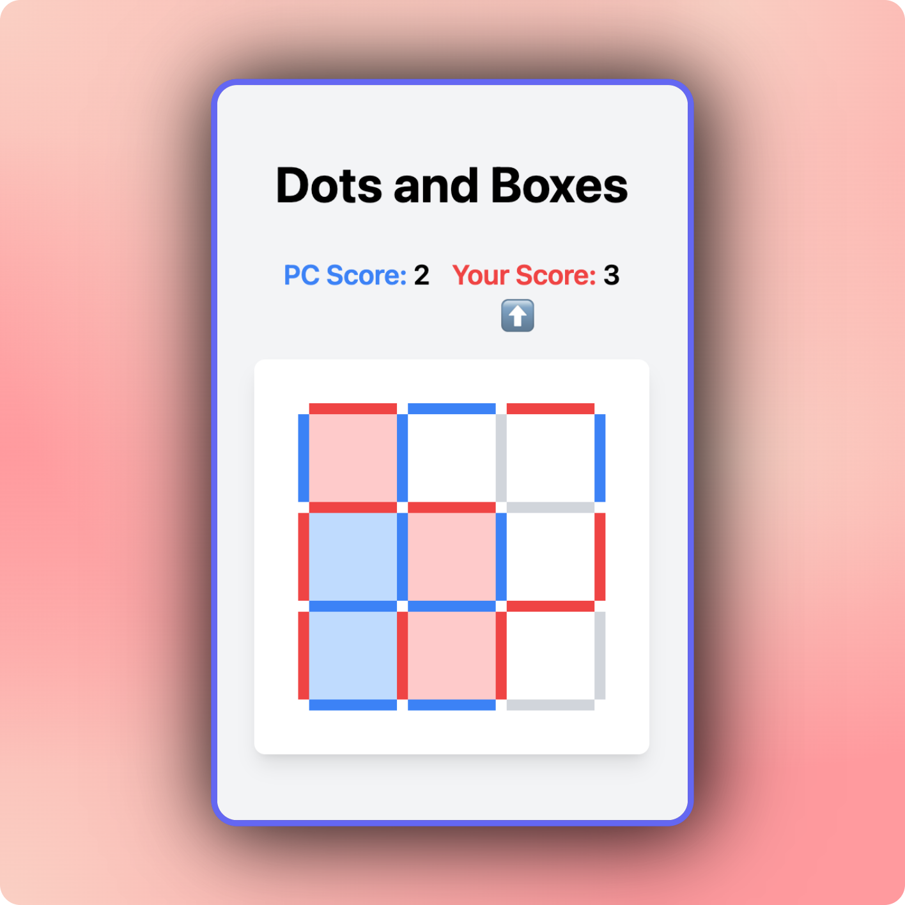

# Box 'Em All - An Approach to Solve Dots & Boxes with Reinforcement Learning

## Overview

Box 'Em All is a project that aims to solve the classic game of Dots & Boxes using reinforcement learning techniques. The game involves two players taking turns to draw lines between dots on a grid. The objective is to complete more boxes than the opponent. This project implements various strategies, including Q-learning, to train agents to play the game effectively.

## Game Rules

1. The game is played on a grid of dots.
2. Players take turns to draw a line between two adjacent dots, either horizontally or vertically.
3. When a player completes the fourth side of a box, they claim that box and earn a point.
4. The player who completes a box gets another turn.
5. The game ends when all boxes are completed.
6. The player with the most boxes at the end of the game wins.

## Project


### Installation

1. **Clone the repository:**

    ```sh
    git clone https://github.com/yourusername/box-em-all.git
    cd box-em-all
    ```

2. **Install dependencies:**

    Make sure you have [Poetry](https://python-poetry.org/) installed. Then run:

    ```sh
    poetry install
    ```

3. **Activate the virtual environment:**

    ```sh
    poetry shell
    ```

### Training the Model

To train the Q-learning or DQN model, run main and ensure the right runtime:

```sh
python box-em-all/main.py
```


**Playing the Game inline:**


You can play the game against the trained model by setting [is_human]to `True` in the `main.py`

```sh
python box-em-all/main.py
```

**Using Weights & Biases:**

If you want to log the training process using Weights & Biases, set `use_wandb` to `True` and make sure you are logged in to Weights & Biases:

```sh
wandb login
python box-em-all/main.py
```

#### Customization

- **Board Size:** You can change the board size by modifying the `board_size`
- **Hyperparameters:** Adjust the the hyperparameter for example like `alpha`, `gamma`, `epsilon` to tune the Q-learning algorithm.
- **Model Saving/Loading:** The model is saved and loaded from the `model` directory. The model folder is not checked in to git and is only for your local environment. if you want to use a saved model, copy the file to the `player-model`folder. If you want to make it available as frontent player, add an entry to the opponents list in `box-em-all/api.py`

### Game Interface




You can use the flask api to play dots and boxes games. To start the api, run:

```sh
python box-em-all/main.py
```

Based on this api, there is a frontend app (Next.js). See in the folder `dots-and-boxes-frontend` for Details.